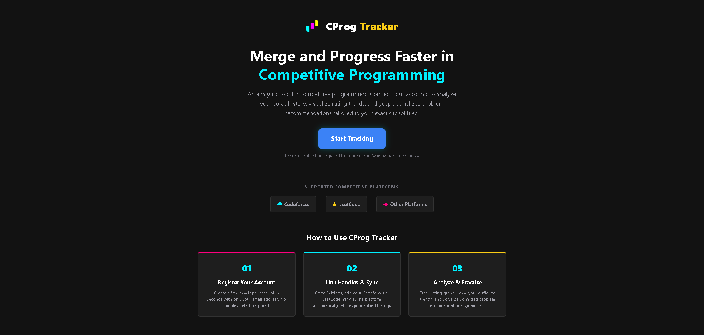
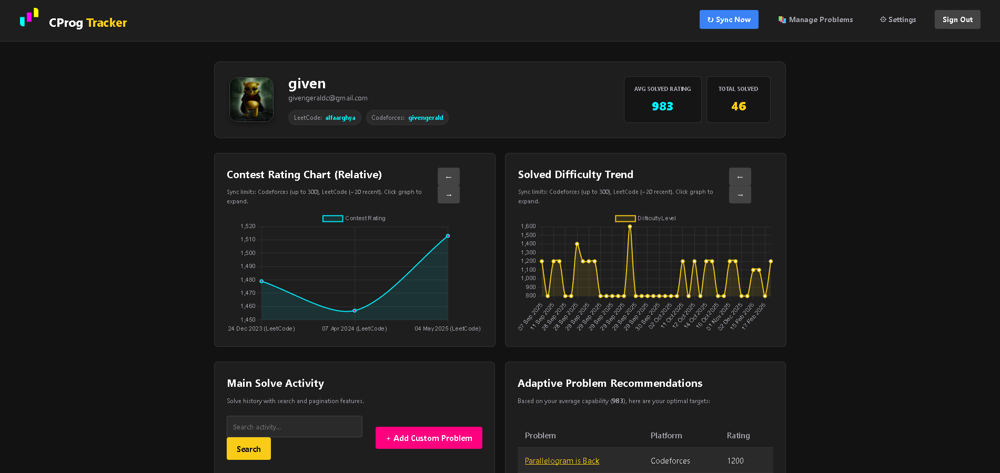
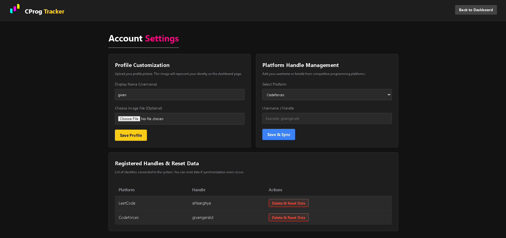
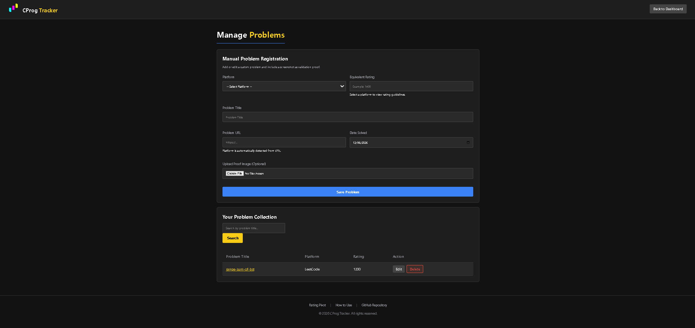

# CProg Tracker

A unified competitive programming dashboard that aggregates your problem-solving history and contest ratings across multiple platforms (Codeforces, LeetCode, AtCoder, etc.) into a single, standardized rating scale.

  

## Features

- **Multi-Platform Sync:** Automatically fetches your submission history and contest ratings from Codeforces and LeetCode using their public APIs.
- **Unified Rating System:** Maps platform-specific difficulties (e.g., LeetCode Easy/Medium/Hard) to a standardized Codeforces-equivalent Elo rating.
- **Performance Analytics:** Visualizes your contest rating trajectory and problem difficulty trends over time using interactive Chart.js graphs.
- **Manual Logging:** Allows you to manually log solved problems from platforms without public APIs (like CSES or HackerRank) by uploading proof screenshots.
- **Smart Recommendations:** Suggests new problems to solve based on your current calculated capability average.

## Tech Stack

- **Frontend:** HTML5, Vanilla CSS (Custom Design System), JavaScript (Chart.js)
- **Backend:** PHP 8.x
- **Database:** MySQL / MariaDB
- **External APIs:** Codeforces API, LeetCode (Alfa API Wrapper)

---

## Installation & Setup

### Prerequisites
- PHP 8.0 or higher
- MySQL or MariaDB
- A local server environment like XAMPP, WAMP, or MAMP.

### 1. Clone the Repository
Clone this project into your local server's web root directory (e.g., `htdocs` for XAMPP).
```bash
git clone https://github.com/yourusername/CProg-Tracker.git
cd CProg-Tracker
```

### 2. Database Configuration
1. Open phpMyAdmin (usually `http://localhost/phpmyadmin`).
2. Create a new database named `cp_viewer`.
3. Import the database schema:
   - Go to the **Import** tab.
   - Upload the `database.sql` file provided in the repository root.
   - Click **Go** to create the tables.
4. If you are deploying to a live server (like Hostinger), update your database credentials in `config/db.php`:
   ```php
   $host     = "localhost";
   $user     = "your_db_username";
   $password = "your_db_password";
   $db_name  = "your_db_name";
   ```

### 3. Run the Application
Start your Apache and MySQL modules, then navigate to the project in your browser:
```text
http://localhost/CProg-Tracker
```

---

## Screenshots

*(Note: Add your actual project screenshots below by replacing the file paths)*

### User Dashboard


### Syncing Handles & Settings


### Manual Problem Entry

---

## Usage Guide

1. **Register/Login:** Create a new local account on the platform.
2. **Add Handles:** Go to the **Settings** page, select a platform (e.g., Codeforces), and enter your public username. Click "Save & Sync" to pull your historical data.
3. **View Analytics:** Navigate to the **Dashboard** to see your calculated average rating and historical charts. Use the pagination arrows to navigate through older data.
4. **Log Custom Problems:** Click "Add Custom Problem", fill out the difficulty, provide the problem link, and upload a screenshot of your Accepted verdict.

## License

This project is open-source and available under the [MIT License](LICENSE).
